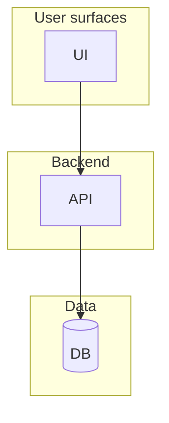

# Living Docs Playbook for AI-Assisted Projects

A portable methodology for keeping project documentation legible to AI coding agents over months of evolution. Copy this file into a new project, follow the playbook, and your docs stay coherent across long development arcs — without relying on discipline you have to remember.

**Audience:** anyone using an AI coding agent (Claude Code, Cursor, Aider, Codex, etc.) on a project that lives longer than a week.
**Time to adopt:** ~30 minutes to set up; ~2 minutes per code change to maintain.

---

## TL;DR

Six doc types, one entry-point file at project root, a status lifecycle declared in YAML frontmatter on every doc. That's it. The structure prevents AI agents from confusing past snapshots with current state, preserves your reasoning trail, separates "what is" from "what to do next", and keeps the messy brainstorm history readable as a portfolio narrative later.

A **companion system — the Prompt Library** (§13) applies the same discipline to reusable prompts: refined, versioned, portable across projects. Same idea (frontmatter + status + refinement before save), different target (techniques that worked, not system state).

Skip to **§11 — Setup checklist** if you just want the bootstrap steps.

---

## 1. The problem this solves

If you've used an AI coding agent on the same project for more than a few weeks, you've probably hit this pattern:

1. Every dev session, you ask the agent *"what would you improve about X?"* → it writes a design doc.
2. After improving X, you ask *"document what changed"* → it writes another doc.
3. After 10 cycles, your `devlog/` has 20+ markdown files from different time-points.
4. You ask the agent *"what's the current architecture?"* → it reads ALL the docs, can't distinguish current state from past snapshots, and produces a Frankenstein answer that confidently mixes timeframes from three months apart.

Three failure modes compound:

1. **Agent confusion.** The AI reads a stale snapshot and acts on it as if it were current — silently. You don't notice until the suggested change conflicts with something that was already shipped.
2. **Lost reasoning.** Six months in, you can't remember *why* you picked approach X over Y. Only the final result survives in code.
3. **Brainstorm trail erosion.** The messy exploration that *produced* the design gets cleaned up out of existence; only polished decisions remain. Useless for portfolio narrative; useless for "should we revisit this?"

This playbook fixes all three structurally — through directory layout and frontmatter conventions, not through habits you have to remember.

---

## 2. The conceptual model — 6 doc types + 1 entry point

| # | Doc type | Filename / location | Purpose | Mutability |
|---|---|---|---|---|
| 1 | **Living snapshot** | `devlog/SYSTEM.md` | "What the system IS right now" — single source of truth | Updated continuously to track code |
| 2 | **Change log** | `devlog/CHANGELOG.md` | "What changed, when, and WHY" — the reasoning trail | Append-only |
| 3 | **Strategy / posture** *(optional)* | `devlog/NORTHSTAR.md` | "What to do next + what to REFUSE" — the single rule, targets, punch list, refuse-list, design rationale | Living — edited when strategy shifts, not on every code change |
| 4 | **Forward proposals** | `devlog/design-evolution/vNN-*.md` | "What we're proposing to change next" — versioned RFCs that double as decision records | New file per proposal; `status` flips through lifecycle |
| 5 | **Historical archive** | `devlog/history/` (or `01_History/`, etc.) | "Where we came from" — frozen snapshots preserving the brainstorm trail | **Never edited** — frozen |
| 6 | **Portfolio narrative** *(optional)* | `devlog/JOURNEY.md` | Guided tour for external readers (recruiters, friends, OSS visitors) | Periodic rewrite |
| ENTRY | **Agent entry-point** | `CLAUDE.md` at project root | The instruction file an AI agent reads first | Edit when meta-rules change |

**Minimum viable subset:** doc types #1, #2, #5, and the entry point. Add #4 when you start proposing future changes you want to track. Add #3 (NORTHSTAR) when "what to do next" and "what to refuse" become decisions you need to encode and defend against scope creep. Add #6 when you want a public narrative.

### Why these specific layers

- **#1 (SYSTEM.md) without #5 (history/)** → no place to put stale designs; the devlog/ root accumulates dead files. Past failure mode.
- **#5 (history/) without #1 (SYSTEM.md)** → no anchor; the agent can't tell which doc to trust.
- **#1 + #5 without #2 (CHANGELOG.md)** → SYSTEM.md changes silently; reasoning is lost.
- **All three without #ENTRY (CLAUDE.md)** → the agent doesn't know what order to read docs in, so it reads them all, defeating the structure.
- **#4 (proposals) is optional** but recommended once your project is past v1.0 — it makes "what's planned" auditable.
- **#3 (NORTHSTAR.md) is optional** but invaluable on projects with scope-creep risk. SYSTEM.md says *what is*; CHANGELOG says *what changed*; vNN proposals say *what we're considering* — none of these say *"don't build X, it's been correctly deferred."* NORTHSTAR is the doc where you encode the **refuse list**. Without it, every two weeks you'll re-litigate the same parked features (skill agents, multi-language support, settings polish, …) because there's no canonical place that records why they were parked. Pair with strict scope discipline.
- **#6 (JOURNEY.md) is optional** but recommended if the project will ever have external readers.

### The four "live" docs at devlog/ root — what each one answers

The three to four files at the root of `devlog/` form a clean question-set. Each one answers exactly one question, and the answers don't overlap:

| Question | Doc |
|---|---|
| *What is the system right now?* | `SYSTEM.md` |
| *What changed, when, and why?* | `CHANGELOG.md` |
| *What should we do next, and what should we refuse?* | `NORTHSTAR.md` *(if used)* |
| *How would a stranger understand this project?* | `JOURNEY.md` *(if used)* |

If two docs start answering the same question, you have drift. The most common drift: SYSTEM.md grows a "Future work" section, then NORTHSTAR also names targets. Pick one (NORTHSTAR for future-work; SYSTEM stays code-mirror only) and prune the other.

---

## 3. Directory layout

```
<project-root>/
├── CLAUDE.md                          # ENTRY POINT — agent reads this first
├── devlog/
│   ├── SYSTEM.md                      # #1 Living snapshot (single source of truth)
│   ├── CHANGELOG.md                   # #2 Reasoning trail
│   ├── NORTHSTAR.md                   # #3 (optional) Strategy / posture / refuse-list
│   ├── JOURNEY.md                     # #6 (optional) Portfolio narrative
│   ├── README.md                      # Human-oriented orientation map
│   ├── design-evolution/              # #4 Forward proposals
│   │   ├── README.md                  # How the versioned stream works
│   │   ├── v01-baseline.md
│   │   ├── v02-<short-title>.md
│   │   └── v03-<short-title>.md
│   ├── history/                       # #5 Historical archive (frozen)
│   │   ├── 00-history-and-decisions.md   # Distilled past
│   │   └── 01-research-arc.md            # Raw preserved sources
│   └── prompts/                       # Companion: prompt library (§13)
│       ├── README.md                  # Prompt-library playbook
│       ├── _TEMPLATE.md               # Starter template for new prompt files
│       └── <slug>.md                  # Refined reusable prompts
```

**Naming conventions:**

- Use ALL_CAPS for top-level living docs (`SYSTEM.md`, `CHANGELOG.md`, `NORTHSTAR.md`, `JOURNEY.md`) — signals "always-relevant top-level". Standard convention from `README.md` / `LICENSE` / `CONTRIBUTING.md`.
- Use `vNN-<kebab-case-title>.md` for proposals — sortable, scannable, status lives in frontmatter not filename.
- Use `NN-<kebab-case-title>.md` for historical numbered docs — preserves chronology when archived.
- The history folder name can be `history/`, `archive/`, `01_History/` — whatever your shell sorts in a useful place. The important thing is it's clearly an archive.
- `NORTHSTAR.md` is the conventional name for the strategy/posture doc. Alternatives: `STRATEGY.md`, `OPERATING_DOC.md`. Pick one — don't have both.

**What NOT to put at `devlog/` root:** anything time-bound, anything per-feature, anything in-progress. Those go into `design-evolution/` (forward) or `history/` (backward). `devlog/` root should only contain doc types #1, #2, #3, #6, and the README.

---

## 4. Status lifecycle

Every doc declares its `status:` in YAML frontmatter. The canonical set:

| Status | Meaning | Mutability | How agents should treat its claims |
|---|---|---|---|
| `living` | Continuously updated to track the code | Mutable | Authoritative for current state |
| `accepted` | Agreed-on reference (baseline / inventory); descriptive of existing state | Edits OK, rare | Authoritative for what it describes |
| `proposal` | Forward-looking; not built yet | Mutable until status flips | Do NOT cite as current |
| `implemented` | Was a proposal; has shipped | Frozen at flip; check `implemented_in:` for refs | Authoritative; describes shipped behavior |
| `superseded` | Replaced by a newer doc | Frozen at flip; `superseded_by:` points to replacement | Stale — read the replacement |
| `archived` / `frozen` | Historical snapshot; not maintained | Frozen | Specifics may be stale — verify against SYSTEM.md before acting |

**Lifecycle for a typical proposal:**

```
proposal ──(decision)──> accepted ──(code lands)──> implemented
                            │
                            └──(replaced later)──> superseded
```

**Lifecycle for a snapshot doc:**

```
living (while being updated) ──(replaced)──> superseded
                              ──(frozen as-is)──> archived
```

When you flip a status, update the matching date field (`decided_date`, `implemented_in`, `superseded_by`) in the same commit.

---

## 5. Frontmatter standards

Three frontmatter shapes. Copy verbatim into new docs.

### 5a. Living docs (SYSTEM.md, CHANGELOG.md, NORTHSTAR.md, JOURNEY.md)

```yaml
---
title: <doc title>
status: living
last_verified: 2026-05-15        # YYYY-MM-DD — bump on every meaningful edit
source_of_truth: <one-line description of where the truth comes from>
ai_guidance: |
  This is the current snapshot. If a claim here disagrees with the code,
  the CODE wins — flag the disagreement rather than silently following.
  Do not mistake docs under devlog/history/ for current state — those are
  frozen archives.
---
```

### 5b. Forward proposals (design-evolution/vNN-*.md)

```yaml
---
title: <doc title>
version: "03"
status: proposal              # proposal | accepted | implemented | superseded
derives_from: v02-<title>.md  # null for v01 baseline
proposed_date: 2026-05-13
decided_date: null            # date when status flips to "accepted"
implemented_in:               # commit hashes / migration numbers when status = "implemented"
  - null
superseded_by: null           # path of replacement vNN, if status = "superseded"
ai_guidance: |
  This is a forward-looking proposal. Read SYSTEM.md for what's actually built.
  Only treat this doc as current if status: implemented.
---
```

### 5c. Archived / historical (history/*.md)

```yaml
---
title: <doc title>
status: archived              # archived | frozen | superseded
snapshot_date: 2026-05-13
purpose: <one-line purpose>
ai_guidance: |
  This is a historical archive, frozen at snapshot_date. It is NOT a guide
  to the current system. Many specific claims here have been superseded
  by later work. For current state, read devlog/SYSTEM.md. Use this file
  only as primary-source citation; verify any specific claim against
  SYSTEM.md and the code before acting.
---

> **⚠ This is a historical archive, frozen at <date>.**
> For the current system, see [`../SYSTEM.md`](../SYSTEM.md).
> For active proposals, see [`../design-evolution/`](../design-evolution/).
> Decisions in this file may have been superseded — verify against `SYSTEM.md` before acting on any claim here.
```

The `> **⚠ ...**` blockquote banner is **belt-and-suspenders** with `ai_guidance:`. Humans read the banner; AI agents read the frontmatter. Both should agree.

---

## 6. The entry-point file (`CLAUDE.md` at project root)

This is the single most important file in the system. An AI agent reads it first; everything else flows from it.

A good `CLAUDE.md` is ~80–150 lines and has two halves:

**Part 1 — Reading the context** (how to find current state vs history)
- Project description (1 paragraph)
- Read order (numbered list pointing at the 6 doc types)
- Status lifecycle table
- The hard rule: *if a doc and the code disagree, the code wins*
- If `NORTHSTAR.md` exists: *before suggesting work, check it against the rule and the refuse-list*

**Part 2 — Updating the docs** (what to do after a code change)
- Step 1: update `devlog/SYSTEM.md`
- Step 2: append to `devlog/CHANGELOG.md`
- Step 3: if you shipped a proposal, flip its status
- Step 4: if you superseded an old doc, mark it
- Step 5: if you're proposing new design, create a `vNN-*.md`
- Step 6: if strategy or refuse-list shifted (rare), update `NORTHSTAR.md` — but NOT on every code change
- When NOT to touch docs

**Template:** see §8.6 below.

Other agent-runtime conventions also work here:
- `AGENTS.md` — newer convention, aliased to CLAUDE.md by some tools
- `.cursor/rules/` — Cursor-specific
- `.aider.conf.yml` + `.aider/CONVENTIONS.md` — Aider-specific

Pick the one your primary agent reads, or maintain `CLAUDE.md` and symlink/duplicate where needed.

---

## 7. Operational playbook

The day-to-day rules. Print this and stick it above your desk if you have to.

### 7.1 When you make a code change

After every change that affects architecture, schema, API surface, or user-facing behavior:

1. **Update `devlog/SYSTEM.md`** — edit the relevant section. Bump `last_verified: <today>` in the frontmatter.
2. **Append to `devlog/CHANGELOG.md`** — at the top under the dated divider:
   ```markdown
   ## YYYY-MM-DD — <short title>

   **What:** <concrete files / tables / modules / pages affected>
   **Why:** <one-or-two-sentence reason — not a description>
   **Impact on SYSTEM.md:** <sections updated, or "none — internal only">
   **Refs:** <commit short hashes / migration numbers / PR refs>
   ```
3. **If this change implemented a proposal** in `design-evolution/`:
   - Flip the proposal's `status: proposal` → `status: implemented`
   - Set `decided_date:` to the date the proposal was accepted (could be earlier than today)
   - Populate `implemented_in:` with commit hashes / migration numbers
4. **If this change superseded an old doc** (rare but happens):
   - On the old doc: `status: superseded`, add `superseded_by: <path of new doc>`
   - On the new doc: note what it supersedes in its own `Status` section

### 7.2 When you propose a new design (no code yet)

1. Create `devlog/design-evolution/vNN-<kebab-title>.md` (next available `vNN`).
2. Frontmatter: `status: proposal`, `derives_from: <previous vNN>`, `proposed_date: <today>`.
3. Use the dual RFC+ADR shape — three sections after the intro, before the body:
   - `## Status` (state, decision date null, implementation null, supersedes, superseded_by)
   - `## Alternatives considered` (table: option / why rejected)
   - `## Consequences` (✅ unlocks / ⚠️ trade-offs / ❌ rules out)
4. Add an entry to `CHANGELOG.md` recording the new proposal:
   ```markdown
   ## YYYY-MM-DD — vNN proposal: <short title>

   **What:** New `devlog/design-evolution/vNN-<title>.md`.
   **Why:** <what triggered this proposal>
   **Impact on SYSTEM.md:** none yet — proposal, not built.
   **Refs:** no commit (doc only).
   ```

### 7.3 When you archive a doc

Move it from `devlog/` root or `design-evolution/` into `devlog/history/`. Update its frontmatter:
- `status: archived`
- `snapshot_date: <today>`
- Add the `> **⚠ This is a historical archive ...**` blockquote banner near the top.
- Strengthen the `ai_guidance:` field to spell out that this is frozen.

Then **fix any inbound links** to the old location. Run a grep for the old path.

### 7.4 When you're doing pure research / exploration (no code changes)

- **Do not** touch `SYSTEM.md` or `CHANGELOG.md`.
- If you spot a doc-code drift while reading, **flag it** to the user but do not silently rewrite the doc.
- The user decides whether to fix the doc or the code.

### 7.5 When you consolidate old docs

The pattern: as `devlog/` accumulates, you'll periodically want to consolidate.

- Write a single consolidated doc (distilled or preserved-full-text) and put it in `history/`.
- Mark the originals `status: superseded`, `superseded_by: history/<consolidated>.md`.
- After verification, delete the originals (git history preserves them).
- Update README.md and any inbound links.

Two valid consolidation modes:
- **Distill** — synthesize ~10K lines into ~1500 lines of narrative + decision log. Good for a primary read-once history. Loses detail.
- **Preserve** — merge full text under one cover. Good as primary-source citation archive. Verbose but lossless.

You can do both: a distilled `history/00-history.md` for reading, plus a preserved `history/01-research-arc.md` for citation. (See the AlloyNext case study in §9.)

---

## 8. Templates (copy-paste)

### 8.1 `devlog/SYSTEM.md` skeleton

```markdown
---
title: <Project> — System Documentation (Living Snapshot)
status: living
last_verified: YYYY-MM-DD
source_of_truth: direct code audit of <key directories>
ai_guidance: |
  This is the current system snapshot. If a claim here disagrees with the
  code, the CODE wins — flag the disagreement rather than silently following.
---

# <Project> — System Documentation

<One-paragraph description of what the project IS.>

---

## Architecture at a glance

<Mermaid diagram, container level (C4 Level 2). 6–10 boxes max.>



---

## 1. High-level architecture
<Deeper ASCII / prose breakdown.>

## 2. Data layer
## 3. Backend modules
## 4. API surface
## 5. Frontend
## 6. Deploy
## 7. Glossary

## N. How to maintain this document

When the system changes:
1. Update the relevant section here.
2. Append a dated entry to `CHANGELOG.md`.
3. Bump `last_verified:` in the frontmatter.
4. If a section is stale (claim disagrees with code), the code wins — update the doc.
```

### 8.2 `devlog/CHANGELOG.md` skeleton

```markdown
---
title: <Project> — Change Log
status: living
last_verified: YYYY-MM-DD
companion_doc: devlog/SYSTEM.md
ai_guidance: |
  This is the LIVING change log — entries appended chronologically (newest
  first under the dated divider). Use it to recover the WHY behind any
  change. Each entry pairs with a section update in SYSTEM.md.
---

# <Project> — Change Log

## Format

```
## YYYY-MM-DD — <short title>

**What:** <files / tables / modules / pages affected, concrete>
**Why:** <reason in one or two sentences>
**Impact on SYSTEM.md:** <section(s) updated; or "none — internal only">
**Refs:** <commit short hashes / migration numbers / PR refs if any>
```

---

## YYYY-MM-DD — <most recent entry>

**What:** ...
**Why:** ...
**Impact on SYSTEM.md:** ...
**Refs:** ...

---

## How to append a new entry

(Same template, newest first under the dated divider.)
```

### 8.3 `devlog/design-evolution/vNN-*.md` skeleton (dual RFC+ADR)

```markdown
---
version: "NN"
title: <Short proposal title>
status: proposal              # proposal | accepted | implemented | superseded
derives_from: v<NN-1>-<previous-title>.md
proposed_date: YYYY-MM-DD
decided_date: null
implemented_in:
  - null
superseded_by: null
owner: <author>
source_of_truth:
  - <list of files / code locations the proposal is grounded in>
ai_guidance: |
  This is a forward-looking proposal. Read SYSTEM.md for what's actually built.
  Only treat this doc as current if status: implemented.
---

## 0. What this document is

<2–3 paragraphs: what's being proposed, why now, what it derives from.>

---

## Status

- **State:** proposal
- **Decision date:** null (open for review)
- **Implementation:** null
- **Supersedes:** none (or `<prior vNN>` § N)
- **Superseded by:** none

## Alternatives considered

| # | Option | Why rejected |
|---|---|---|
| 1 | <alternative A> | <why it lost> |
| 2 | <alternative B> | <why it lost> |

## Consequences

What shipping this proposal would do:

- ✅ <thing it unlocks>
- ⚠️ <trade-off / new constraint>
- ❌ <thing it rules out>

---

## 1. <First substantive section>

<Body of the proposal.>

---

## 2. <Next section>

...
```

### 8.4 `devlog/NORTHSTAR.md` skeleton (strategy / posture / refuse-list)

The strategy doc. Where the *single rule*, *targets*, *punch list*, and **refuse list** live. Edit when strategy shifts — NOT on every code change (that's SYSTEM + CHANGELOG).

```markdown
---
title: <Project> — North Star
status: living
last_verified: YYYY-MM-DD
companion_docs:
  - devlog/SYSTEM.md            # what is now
  - devlog/CHANGELOG.md         # what changed
ai_guidance: |
  This is STRATEGY and POSTURE — not architecture. Use it to decide whether a
  proposed piece of work earns time. For "what's actually built today", read
  SYSTEM.md. Before suggesting new features or modules, check this doc's
  refuse-list (Part VI) — many ideas are CORRECTLY-DEFERRED, not bad. The
  single rule (Part I) is the gate every suggestion must pass.
---

# <Project> — North Star

> **Posture:** <one line — e.g. "Scope discipline. ~92% built, 0% shipped. The gap closes with users, not code.">

---

## Part I — The single rule

**A suggestion only earns time if it does one of <N> things:**

1. <track 1 — e.g. "Closes the line-1-to-live-graph UX gap">
2. <track 2 — e.g. "Ships the transcript wedge">
3. <track 3 — e.g. "Puts the system in front of real users">

Everything else defers. Refuse new features, new phases, new architectural layers until the above move.

---

## Part II — N-day targets

| Target | Why this matters |
|---|---|
| <concrete target — e.g. "5 strangers using the extension"> | <the single reason> |
| <killer demo polished — e.g. "open file → past bugs in <2s"> | <why this is the wow moment> |

---

## Part III — Punch list

A flat checklist of P0/P1 work, with explicit `[done]` / `[wip]` / `[todo]` markers. When something ships, move it under `## Resolved` rather than deleting it — preserves the audit trail.

- [todo] <P0 #1>
- [wip]  <P0 #2>
- [done] <P1 #3>

---

## Part IV — What to refuse

The list of ideas that are NOT being built — not because they're bad, but because they're correctly-deferred. Each entry has *one line on why it's deferred* so the next person doesn't have to re-litigate.

- **<idea>** — <why deferred — e.g. "deepens build-vs-ship gap; revisit after field test">
- **<idea>** — <why deferred>
- **<idea>** — <why deferred>

---

## Part V — Design rationale (why it's built this way)

Why the *shape* of the system is the way it is — the principle-level reasoning that any individual code change inherits from. Not the architecture (that's SYSTEM.md); not the change history (that's CHANGELOG). The *why behind the why*.

<2–4 paragraphs grounded in: the problem class, the market alternatives, the inherit-vs-build mapping, the research backing the choices.>

---

## Part VI — When future-Claude reads this

Treat NORTHSTAR as the **gate**. Before suggesting work, ask:
- Does it match one of the tracks in Part I?
- Is it on the refuse list (Part IV)? If yes, refuse the suggestion — cite the line.
- Are the N-day targets (Part II) already moved? If not, that's what to do.
```

**Why a separate doc instead of a "Future work" section in SYSTEM.md:**

SYSTEM.md tracks the code (mutates with every change). NORTHSTAR tracks strategy (changes when posture shifts — much less often). Mixing them means SYSTEM.md grows speculative "we'll probably do X next" sections that lie about current state. Keep them separate: SYSTEM.md is past-tense ("what we built"), NORTHSTAR is future-tense ("what earns time"). The CHANGELOG is the bridge ("how we got from past A to past B").

The **refuse list** is the load-bearing piece. Without it, every two weeks you'll re-discuss the same parked features (skill agents, multi-language support, theme toggle, …) because there's no canonical place that records "yes, this was considered; no, not now; here's why." NORTHSTAR is that place.

---

### 8.5 `devlog/history/<file>.md` archived-doc skeleton

```markdown
---
title: <original title>
status: archived
snapshot_date: YYYY-MM-DD
purpose: <one-line purpose — what this doc was for at the time>
ai_guidance: |
  This is a historical archive, frozen at snapshot_date. It is NOT a guide
  to the current system. Many specific claims here have been superseded.
  For current state, read devlog/SYSTEM.md. Use this file only as primary-
  source citation; verify any specific claim against SYSTEM.md before acting.
---

> **⚠ This is a historical archive, frozen at YYYY-MM-DD.**
> For the current system, see [`../SYSTEM.md`](../SYSTEM.md).
> For active proposals, see [`../design-evolution/`](../design-evolution/).
> Decisions in this file may have been superseded — verify against `SYSTEM.md` before acting on any claim here.

# <Original title>

<Original content, unmodified.>
```

### 8.6 `CLAUDE.md` skeleton (project root)

```markdown
# CLAUDE.md — instructions for AI coding agents

The single instruction file. Read this first; everything else flows from it.

## What <Project> is

<One-paragraph description.>

---

## Part 1 — Reading the context

Read in this order:

1. **`devlog/SYSTEM.md`** — current architecture. Single source of truth.
2. **`devlog/NORTHSTAR.md`** *(if present)* — strategy + the **refuse list**. Read this BEFORE suggesting new work — many ideas are correctly-deferred, not bad. The single rule (Part I) is the gate every suggestion must pass.
3. **`devlog/CHANGELOG.md`** — what changed recently, with reasons.
4. **`devlog/design-evolution/`** — forward-looking proposals. Read the highest-numbered `vNN-*.md` first. Check `status:` — only `implemented` reflects built state.
5. **`devlog/history/`** — **frozen archive.** Only open when you need the reasoning trail behind a decision.

Before acting on any doc, read its frontmatter `status:` and `ai_guidance:` fields.

### Status lifecycle

| Status | Treat as |
|---|---|
| `living` | Authoritative for current state |
| `accepted` | Authoritative for what it describes |
| `proposal` | Not yet built — do NOT cite as current |
| `implemented` | Shipped (check `implemented_in`) |
| `superseded` | Stale — read `superseded_by` instead |
| `archived` / `frozen` | Historical — verify before acting |

### The hard rule

**If a doc and the code disagree, the code wins.** Flag the disagreement; never silently follow the doc.

---

## Part 2 — Updating the docs

After every code change that affects architecture, schema, API, or behavior:

### Step 1 — Update `devlog/SYSTEM.md`
Edit the relevant section. Bump `last_verified:` in frontmatter.

### Step 2 — Append to `devlog/CHANGELOG.md`
```markdown
## YYYY-MM-DD — <short title>

**What:** ...
**Why:** ...
**Impact on SYSTEM.md:** ...
**Refs:** ...
```

### Step 3 — If you shipped a `design-evolution/vNN-*.md` proposal
Flip its frontmatter: `status: proposal` → `status: implemented`, fill `decided_date` and `implemented_in`.

### Step 4 — If you superseded an existing doc
Old doc: `status: superseded`, add `superseded_by:`. New doc: note what it supersedes in its `## Status` section.

### Step 5 — If you're proposing a NEW design (no code yet)
Create `devlog/design-evolution/vNN-<title>.md`. Frontmatter: `status: proposal`, `derives_from:`, `proposed_date:`. Use the dual RFC+ADR shape (Status / Alternatives considered / Consequences). Add an entry to CHANGELOG.

### Step 6 — If strategy or refuse-list shifted (rare)
Update `devlog/NORTHSTAR.md`. This is NOT a per-code-change activity — only edit when:
- A new track is added to (or removed from) the single rule (Part I).
- A target was met or moved.
- A previously-refused idea is being promoted (move from Part IV → Part III punch list).
- A new "correctly-deferred" idea is being added to the refuse list — record *why* it's deferred so future-Claude won't re-litigate it.

### When NOT to touch docs

- Pure research / Q&A sessions: read only.
- Drift discovered: flag to user; don't silently rewrite.
- `devlog/history/`: never edit. Frozen.
- `devlog/NORTHSTAR.md`: do NOT edit on routine code changes. Strategy moves slowly.
```

---

## 9. Case studies — two projects, two adoptions

The playbook was extracted from one project, refined by adoption in a second.

### 9.1 AlloyNext (origin — the 5-type system, no NORTHSTAR)

**Initial state (the failure that prompted the redesign):**
- 20+ markdown docs at `devlog/` root, all named like `NN-<topic>.md`
- Each represented a different time-snapshot from 10 months of dev
- AI agents would read them all → confuse 6-month-old design with current state → suggest changes against stale models

**What was built:**
- `devlog/SYSTEM.md` — code-audited, single source of truth
- `devlog/CHANGELOG.md` — every change with what/why/refs
- `devlog/design-evolution/v01..v05` — versioned proposals
- `devlog/01_History/` — frozen docs (distilled + preserved-full + user-guide archive)
- `devlog/JOURNEY.md` — ~600 words, portfolio narrative for recruiters
- `CLAUDE.md` at root — agent instruction file
- `devlog/prompts/` — companion prompt library

**Result:** a fresh Claude session reading `CLAUDE.md` → `SYSTEM.md` produces a coherent answer about current state without citing `01_History/` as current. Drift signals are explicit via `ai_guidance:`.

### 9.2 Alloygraph (the 6-type system — NORTHSTAR added)

**The gap AlloyNext didn't expose:** Alloygraph is a near-feature-complete system (~92% built, 0% shipped) with high scope-creep pressure. Every two weeks a new layer suggested itself — skill agents, multi-language Tree-sitter, 3D graphs, Story Mode, settings polish, observability stack. Each individually plausible; all of them, taken together, deepened the build-vs-ship gap instead of closing it.

SYSTEM.md couldn't carry this — SYSTEM mirrors *code*, not *strategy*. The CHANGELOG could record decisions but not *defend* them prospectively. vNN proposals could hold "what we'd build" but not "what we're refusing to build." There was no doc that said *"yes this is a good idea; no, not now; here's why."*

**What was added:** `devlog/NORTHSTAR.md` — the strategy/posture doc that became the 6th type in this playbook. Six parts:

1. **The single rule** — three tracks of work that earn time; everything else defers.
2. **N-day targets** — concrete outcomes that, if not met, the project hasn't moved.
3. **Punch list** — flat `[todo]`/`[wip]`/`[done]` items, with completed items moved under `## Resolved` for the audit trail.
4. **What to refuse** — the load-bearing list. Each entry has one line on *why* it's deferred so future-Claude / future-self doesn't re-litigate it.
5. **Design rationale** — why the *shape* of the system is what it is; the principle-level reasoning that individual code changes inherit from.
6. **When future-Claude reads this** — the gate text: check the rule, check the refuse list, check the targets.

**Result:** the SYSTEM+CHANGELOG pair stayed code-mirror only; NORTHSTAR absorbed the strategic content. The "refuse list" became citable — *"no, that's on NORTHSTAR Part IV"* — instead of re-litigating every two weeks. The case for NORTHSTAR is strongest on projects where scope discipline matters more than feature velocity.

**Generalized lesson:** if you find your team (or your agent) repeatedly suggesting the same parked features, add NORTHSTAR. The refuse list pays for itself within one sprint.

The full live examples for both projects are in their respective repo trees. Look at any of the files referenced above as concrete templates.

---

## 10. Anti-patterns (don't do these)

1. **Numbered chronological docs at `devlog/` root** (`01-foo.md`, `02-bar.md`, ...) without status frontmatter. This is the failure mode this playbook fixes. If you see a project doing this, suggest the playbook.

2. **Parallel ADR directory** (e.g. separate `devlog/adr/` alongside `devlog/design-evolution/`). Two layers to keep in sync → drift. The dual RFC+ADR pattern (proposals double as decision records) avoids this.

3. **Auto-summarizing old docs into SYSTEM.md without archiving the originals.** Loses the brainstorm trail. Always move originals to `history/` first.

4. **Living docs without `last_verified:` dates.** Agents can't tell freshness; you'll re-create the original problem.

5. **`ai_guidance:` fields that just repeat the title.** The field exists to give explicit reading instructions to AI agents. Use it to encode "this is current" vs "this is stale" vs "verify against X first".

6. **Editing `history/` docs after archiving.** Defeats the "frozen" guarantee. If you need to add information, add it to SYSTEM.md or CHANGELOG.md and reference the history doc by date.

7. **Multiple competing entry points** (`CLAUDE.md` + `AGENTS.md` + `CONVENTIONS.md` + `.cursorrules` all with different content). Pick one canonical entry point per agent runtime; symlink or reference from the others.

8. **Putting personal/secret info in living docs.** Living docs get committed and indexed. Keep `.env`, API keys, etc. out. Personal framings (resume content, archetype preferences, etc.) live in living docs only if you intend them to be public — otherwise gitignore them.

9. **Doc-only sessions that touch SYSTEM.md.** SYSTEM.md tracks the code. If the code didn't change, SYSTEM.md shouldn't either. Reserve doc-only work for `design-evolution/` proposals.

10. **Verbose CHANGELOG entries.** One-paragraph descriptions defeat scannability. Use the strict `What / Why / Impact / Refs` shape. The `Why` is the only field that should ever read like prose — the rest are factual.

11. **Putting strategy / "future work" / refuse-list content in SYSTEM.md.** SYSTEM.md is a code mirror — it mutates with every code change. The moment it grows a "Coming soon" or "Refused features" section, it starts lying about current state, and `last_verified:` no longer means what it claims. Promote that content to NORTHSTAR.md instead. If your project doesn't have a NORTHSTAR yet, keep strategy in your head or a separate scratch file until you've justified the new doc.

12. **NORTHSTAR.md without a refuse list.** A NORTHSTAR that only has goals + targets is just OKRs — useful, but not load-bearing. The refuse list is what makes it pay for itself: every "what about X?" suggestion gets answered by pointing at Part IV, instead of re-debating.

13. **Updating NORTHSTAR on every code change.** It's not CHANGELOG. Strategy moves slowly. If you find yourself touching NORTHSTAR every sprint, the line between strategy and tactics has slipped — the tactical content belongs in CHANGELOG or vNN proposals.

---

## 11. Setup checklist (bootstrap from zero)

Use this on a new project, or to retrofit an existing one.

- [ ] **Step 1 — Create the directory structure**
  ```
  mkdir -p devlog/design-evolution devlog/history
  touch devlog/SYSTEM.md devlog/CHANGELOG.md devlog/README.md
  touch devlog/design-evolution/README.md
  touch CLAUDE.md
  ```

- [ ] **Step 2 — Populate `devlog/SYSTEM.md`** with the §8.1 skeleton. Fill in the current architecture from a code audit. Add a Mermaid container diagram. Set `last_verified:` to today.

- [ ] **Step 3 — Populate `devlog/CHANGELOG.md`** with the §8.2 skeleton. Backfill a few recent meaningful changes from `git log` so the format is established.

- [ ] **Step 4 — Populate `CLAUDE.md`** at project root with the §8.6 skeleton. Customize the project description and read order.

- [ ] **Step 5 — Populate `devlog/README.md`** with a human-oriented orientation map (1 paragraph per doc type, with links).

- [ ] **Step 6 — Populate `devlog/design-evolution/README.md`** explaining the versioned stream and how to add a `vNN-*.md`.

- [ ] **Step 7 — (Optional) Create `devlog/design-evolution/v01-baseline.md`** to anchor the design-evolution stream. Frontmatter `status: accepted`, body = current architecture description. This becomes the floor for future `vNN` proposals.

- [ ] **Step 7b — (Optional, recommended for projects with scope-creep risk) Create `devlog/NORTHSTAR.md`** with the §8.4 skeleton. Even if you start with just the single rule (Part I) + the refuse list (Part IV), that's enough — the rest fills in as targets become real. Update `CLAUDE.md` read order to include it. Trigger: you're re-discussing the same parked feature for the third time.

- [ ] **Step 8 — Archive existing legacy docs** into `devlog/history/`. Add the archive frontmatter + banner from §8.5 to each. Delete from `devlog/` root or wherever they were.

- [ ] **Step 9 — Run a grep** for any remaining links pointing at the old locations. Fix them.

- [ ] **Step 10 — Test the agent.** Open a fresh AI agent session. Ask: *"What's the current architecture? What are the open proposals?"* The agent should read `CLAUDE.md` → `SYSTEM.md` → (optionally) `design-evolution/v01` and answer cleanly, without citing anything under `history/` as current. If you adopted NORTHSTAR, also ask *"What's on the refuse list?"* — the agent should be able to cite Part IV directly.

- [ ] **Step 11 — Bootstrap the prompt library** (optional but recommended — see §13.11):
  ```
  mkdir prompts
  ```
  - Create `devlog/prompts/README.md` from §13.1–13.9 content
  - Create `devlog/prompts/_TEMPLATE.md` from §13.6 frontmatter + §13.7 body template
  - Add the "Part 3 — Saving reusable prompts" section (§13.10) to `CLAUDE.md`

- [ ] **Step 12 — Commit.** A single commit titled `docs: adopt living-docs playbook` is fine.

- [ ] **Step 13 — On every code change, follow §7.1.** It's 2 minutes of work that prevents weeks of drift.

- [ ] **Step 14 — On every good prompt, save it.** When you write a long prompt that produces a great result, say *"save this prompt"* and let the agent run the §13.5 workflow. The library compounds across projects.

---

## 12. Verification tests

Run these periodically (every month or after big merges) to confirm the system is working.

### Test 1 — Agent confusion test
Open a fresh AI agent session. Ask: *"What's the current architecture of <project>? What are the open design proposals?"*
- **Pass:** agent cites `SYSTEM.md` and the latest `design-evolution/vNN` with `status: proposal`. Does NOT cite history/ files as current.
- **Fail:** agent cites specifics from `history/` as if current. The `ai_guidance` on that doc isn't strong enough — sharpen it.

### Test 2 — Reasoning recovery test
Ask: *"Why was decision X made the way it was?"*
- **Pass:** agent finds the rationale in `CHANGELOG.md` and/or a `design-evolution/vNN` Status section.
- **Fail:** agent reasons from scratch or hallucinates. CHANGELOG entries are too vague — the `Why:` field needs to be more substantive.

### Test 3 — Drift detection
Pick a random claim from `SYSTEM.md`. Verify it against the code.
- **Pass:** matches.
- **Fail:** drift — fix SYSTEM.md and bump `last_verified:`. Investigate when the drift started.

### Test 4 — Time-travel test
After 3 months of development, repeat Test 1. The system should still pass.
- **Fail:** discipline is slipping. Look at `last_verified:` dates — anything older than your release cadence is suspect. Consider a pre-commit hook that nags when SYSTEM.md hasn't been touched in N days.

### Test 5 — Refuse-list test *(if NORTHSTAR.md is in use)*
Ask: *"I'd like to add `<idea on the refuse list>` — should we?"*
- **Pass:** agent cites NORTHSTAR Part IV (or your refuse-list section) by name, quotes the line on *why* it's deferred, and offers to refuse the suggestion unless the user wants to override.
- **Fail:** agent enthusiastically scopes the work without checking NORTHSTAR. Either NORTHSTAR's `ai_guidance:` is too weak, or `CLAUDE.md` Part 1 doesn't put NORTHSTAR ahead of code suggestions in the read order. Sharpen both.

---

## 13. Companion system — the Prompt Library

A second versioned library that pairs with the doc system. Same discipline (frontmatter, status, refinement before save), different target — instead of versioning what the system IS, you're versioning **the prompts that worked**.

### 13.1 The problem it solves

You write long prompts. Some produce great output. You'd reuse them — in this project, or the next one — but they get buried in chat history. Three months later, you write a near-identical prompt from scratch because you forgot you'd solved this before.

Same fix as the doc system, applied to prompts: a curated, deduplicated, refined store of techniques that compounds across projects. The prompts library is the artifact your prompt-engineering skill ships as.

### 13.2 The core rule

**Never save raw prompts. Always refine first.**

The refinement IS the value. A raw transcript captures what you said; a refined entry captures *why it worked*. Without refinement, you have a chat archive — not a library.

### 13.3 Directory layout

```
<project-root>/
└── devlog/prompts/
    ├── README.md            # full playbook (this section, in long form)
    ├── _TEMPLATE.md         # starter template for new prompt files
    ├── <slug-1>.md
    ├── <slug-2>.md
    └── ...
```

When the library grows past ~15 files, sub-folder by category:

```
devlog/prompts/
├── research/          # research-oriented prompts
├── implementation/    # code-implementation prompts
├── review/            # audit / review prompts
├── writing/           # doc / narrative prompts
└── meta/              # prompts about prompts
```

Start flat. Restructure only when flat stops being scannable.

### 13.4 When to save

Save when:
- A long prompt produced a notably good result and feels reusable
- The prompt encodes a non-obvious technique (a structure, a constraint, a framing) that took effort to discover
- You'll reuse it in this project later, or carry it to other projects

Don't save:
- One-off questions, trivial prompts
- Prompts that didn't work (unless explicitly archiving failures with `status: failed`)
- Prompts that are 80% boilerplate, 20% one-line context — save just the technique

### 13.5 The save workflow (7 steps)

When the user says *"save this prompt"* (or similar), an AI agent should:

1. **Locate** the raw prompt in the user's recent turn. Ask if ambiguous.
2. **Identify what made it work** — goal, technique, constraints, what's project-specific vs portable. *This is the load-bearing step.* Skip it and refinement is cosmetic.
3. **Refine** — tighten language, replace project-specific bits with `<UPPER_SNAKE_CASE>` placeholders, preserve the user's voice and sharp framing.
4. **Pick a kebab-case slug** — short, descriptive, action-oriented (e.g. `research-industry-practice`, `audit-system-arch`).
5. **Save to `devlog/prompts/<slug>.md`** using the template in §13.7. Fill every frontmatter field.
6. **If updating an existing prompt** of the same purpose — edit in place, bump `last_used:`, append to `## History`.
7. **Report back** — one line on what was saved + why this version is better than raw.

### 13.6 Frontmatter standard

```yaml
---
title: <Short descriptive title — sentence case>
slug: <kebab-case-slug-matching-filename>
scope: portable               # portable | project
status: active                # active | experimental | deprecated | failed
tags:
  - <tag1>
  - <tag2>
created: YYYY-MM-DD
last_used: YYYY-MM-DD
last_refined: YYYY-MM-DD
origin_session: |
  <2–3 sentences: what task this prompt was first written for, what was
  happening in the project, what the outcome was>
see_also:                     # optional — related prompts
  - devlog/prompts/<related-slug>.md
---
```

Two important fields:

- **`scope: portable`** — works in any project; all project-specific bits replaced with placeholders. Carry to other repos.
- **`scope: project`** — references project-specific code or conventions. Use as reference when writing the portable version; don't carry verbatim.

### 13.7 Body template

Six sections after the frontmatter:

```markdown
# <Title>

## When to use this
<1–3 sentences. The "if you're trying to X, reach for this" frame.>

## Required context to fill in
- `<PLACEHOLDER_1>` — <what it represents> (example: ...)
- `<PLACEHOLDER_2>` — <what it represents> (example: ...)

## The prompt
\`\`\`
<The refined prompt body, with <PLACEHOLDER> tokens inline. This is the
bit you copy-paste when invoking — self-contained.>
\`\`\`

## Notes on what works
- <Technique 1 that makes this prompt produce good output>
- <Constraint that matters>
- <What to watch for if the agent goes off-track>

## Variations (optional)
- **Short version** — <how to truncate>
- **Deep version** — <how to expand>

## History
- YYYY-MM-DD: <invocation context>. **Outcome:** <what came out>.
```

The most valuable section is `## Notes on what works`. Without it, the prompt is a black box. With it, future-you (or another agent) learns the technique behind the words.

### 13.8 Anti-patterns

1. **Saving raw prompts without refinement.** Defeats the point — refinement IS the value.
2. **Vague slugs.** `good-prompt.md`, `prompt-1.md`, `the-thing-that-worked.md`. You won't find them in 3 months.
3. **Versioning by filename.** `audit-v1.md`, `audit-v2.md`. Don't — the file IS the latest version. History lives in `## History`. If a variant diverges meaningfully, give it a new descriptive slug.
4. **Placeholder explosion.** If 80% of the prompt is `<PLACEHOLDERS>`, you've abstracted too far. Should still read naturally with placeholders left as defaults.
5. **Stripping the user's voice.** "Brief is bad — go deep" was probably what made the prompt work. Don't soften it to "please provide a thorough response."
6. **No `Notes on what works` section.** Without it the prompt is opaque. Always distill the technique.

### 13.9 Cross-project portability

When carrying prompts to another project:

1. Copy `devlog/prompts/` wholesale.
2. Filter to `scope: portable` entries (delete or quarantine `scope: project`).
3. Drop entries where `tags:` don't match the new project's domain.
4. For each carried prompt, update `origin_session:` with a note about the new project and reuse date.
5. The `<PLACEHOLDER>` tokens make filling in new-project context obvious.

The portable prompts library compounds across projects. The same techniques that worked in one codebase tend to work in the next — but only if you saved them refined.

### 13.10 Entry-point hook (CLAUDE.md addition)

Add this to your project-root `CLAUDE.md` so a fresh agent session knows the trigger phrase and the workflow:

```markdown
## Part 3 — Saving reusable prompts

When the user says **"save this prompt"**, **"save this"**, **"add this to the prompt library"**, or similar, follow the playbook in `devlog/prompts/README.md`. **Never save raw prompts** — refinement is the point.

Quick reference:

1. Locate the raw prompt in the user's recent turn.
2. Identify what makes it work — goal, technique, constraints, project-specific bits.
3. Refine — tighten, replace project-specific bits with `<UPPER_SNAKE_CASE>` placeholders, preserve voice.
4. Pick a kebab-case slug.
5. Save to `devlog/prompts/<slug>.md` using `devlog/prompts/_TEMPLATE.md`. Fill every frontmatter field.
6. If updating — edit in place, bump `last_used:`, add to `## History`.
7. Report back — one line on what was saved and why this version is better than raw.
```

### 13.11 Bootstrap checklist (for a new project)

- [ ] `mkdir prompts`
- [ ] Create `devlog/prompts/README.md` — copy §13.1–13.9 content (the playbook itself)
- [ ] Create `devlog/prompts/_TEMPLATE.md` — copy the frontmatter (§13.6) + body template (§13.7) into one file
- [ ] Add the "Part 3 — Saving reusable prompts" section (§13.10) to `CLAUDE.md`
- [ ] Optionally seed `devlog/prompts/` with 1–2 prompts you already know are reusable (run them through the §13.5 workflow first)

---

## 14. References (the research backing this playbook)

- [Michael Nygard — Architecture Decision Records (Martin Fowler)](https://martinfowler.com/bliki/ArchitectureDecisionRecord.html) — the origin essay for ADRs (2011). The "Context / Decision / Consequences" trio in §8.3 derives from here.
- [MADR — Markdown Architectural Decision Records](https://github.com/adr/madr) — the most widely-used ADR template.
- [Rust RFC process](https://rust-lang.github.io/rfcs/0002-rfc-process.html) — the model for the `vNN-*.md` versioned proposals.
- [Cyrille Martraire — Living Documentation](https://leanpub.com/livingdocumentation) — what `SYSTEM.md` is implementing.
- [Diátaxis framework](https://diataxis.fr/) — four-doc-types model. Useful conceptual distinction (tutorials / how-to / reference / explanation), though this playbook doesn't enforce the full split.
- [Simon Brown — C4 model](https://c4model.com/) — the source for the "container-level diagram" recommendation in §8.1.
- [Anthropic — Effective context engineering for AI agents](https://www.anthropic.com/engineering/effective-context-engineering-for-ai-agents) — frames the agent-confusion problem from Anthropic's side.
- [Andy Matuschak — Work with the garage door up](https://notes.andymatuschak.org/Work_with_the_garage_door_up) — why preserving messy brainstorms matters (`history/`).
- [Eugene Yan — Why-What-How writing](https://eugeneyan.com/writing/writing-docs-why-what-how/) — Amazon-style design-doc structure.
- [DataHub — Continuous context: why AI docs decay](https://datahub.com/blog/continuous-context/) — names the exact failure mode this playbook fixes.

---

## 15. License / sharing

This playbook is methodology, not code — no license. Copy, fork, adapt, redistribute freely. If it helps your project, the only ask is: don't water it down when you share it forward. The strictness is the point — every shortcut here was earned by someone hitting the failure mode.

---

*Playbook version: 1.1. Extracted from the AlloyNext project (2026-05-15). Refined 2026-06-13 by adoption in Alloygraph — added NORTHSTAR.md as the 6th doc type (strategy / posture / refuse-list), distinct from SYSTEM.md (what is) and design-evolution/vNN (what we're proposing). The refuse-list pattern is the load-bearing addition.*
