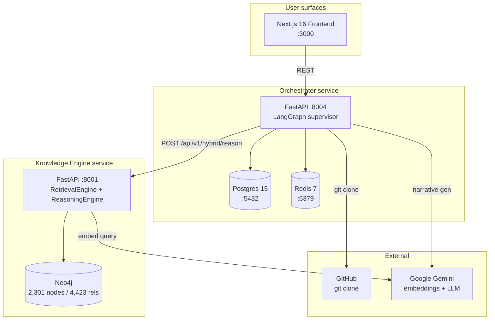

# ArticleTrace

> **Static compliance scanner for AI codebases.** Point it at a public GitHub repo; deterministic scanners detect AI-system patterns and map them to **EU AI Act + GDPR obligations** from a 2,301-node Neo4j knowledge graph, returning a report of likely violations with `file:line` anchors and article citations.

The moat is the rule corpus, not the LLM. LLMs are kept out of the detection hot path and write only the post-hoc narrative — every finding is traceable to a YAML rule, a code anchor, and a regulatory article.

---

## What it does

Point ArticleTrace at a public GitHub repo and it returns a structured compliance report:

1. **Clone + parse.** Git clone (shallow), tree-sitter AST across the project.
2. **Detect** with a strictly-ordered **6-scanner pipeline** (import → AST → LLM-enrich → AST-rules → content → file-pattern → co-occurrence) against **10 YAML detection rules** covering biometric libs, LLM usage, automated-decision endpoints, transparency gaps, PII without DPIA, opaque training data, missing audit logs, prohibited practices, real-time biometric ID, and override gaps.
3. **Classify.** A deterministic risk classifier produces an EU AI Act category (`PROHIBITED` / `HIGH_RISK` / `LIMITED_RISK` / `MINIMAL_RISK`) + a weighted compliance score.
4. **Map** each finding to the relevant EU AI Act Articles / GDPR Articles / Recitals / Obligations using **hybrid GraphRAG** (vector search + multi-hop Neo4j traversal + RRF fusion) over the regulatory KG.
5. **Synthesise** an executive summary + remediation plan via a 4-node LangGraph supervisor.

The detection layer is deterministic; the LLM only writes prose at the end.

## Architecture at a glance



Three live services + three datastores. Two FastAPI backends (Python) + a Next.js 16 frontend (React 19 + Tailwind 4), orchestrated by LangGraph. Designed for Google Cloud Run.

## Headline numbers

| | |
|---|---|
| **Citation recall@15** | **81.8% (27/33)** on the **25-query** golden set (hybrid RRF). Vector-only: 72.7%. Graph-only: 21.2%. **Context relevance@15 (RAGAS-equivalent): 45.9%**. See [`devlog/METRICS.md`](devlog/METRICS.md). |
| Knowledge graph | **2,301 nodes / 4,423 relationships** (Neo4j) |
| Vector index | **2,198 embeddings** at 3072-dim (`gemini-embedding-001`), Neo4j-native HNSW |
| Vector collections | 7 — articles, obligations, recitals, definitions, concepts, rights, interpretive |
| Cross-regulation edges | 84 `COMPLEMENTS` edges spanning 5 interaction types |
| Detection rules | **10 YAML rules** (rule-as-data, Semgrep-style) |
| Scanner pipeline | 6 ordered stages (import / AST / LLM-enrich / AST-rules / content / file-pattern / co-occurrence) |
| Orchestrator graph | **4-node linear LangGraph** (`classify_risk → research_legal → generate_narrative → synthesize`) |
| Cost discipline | LLM kept out of detection hot path; per-scan `cost_tracker` reports `$/scan` |
| Golden test cases | 6, including résumé screening and credit scoring (both EU AI Act Annex III high-risk categories) |

## Status

**Runs locally, end to end.** A scan of `github.com/ageitgey/face_recognition`
completes in ~25 s for about $0.0004, producing 24 findings with `file:line`
anchors mapped to AI Act Art 5 / Annex III / GDPR Art 9.

**The hosted demo is currently down.** The Cloud Run deployment points at a
Neo4j instance that was deleted by the provider's free-tier idle policy, so the
knowledge engine reports `neo4j: disconnected` and the orchestrator does not
respond. The graph itself is intact and restored locally; redeploying is
tracked in [`devlog/NORTHSTAR.md`](devlog/NORTHSTAR.md) Part III. Rather than
link URLs that return errors, they are omitted until the deploy is fixed.

Follow [Quickstart](#quickstart) to run it yourself — that path is tested and
is what CI exercises on every push.


## Why this exists

The pre-pivot version of this project was a free-text RAG Q&A bot — type a description of your AI system into a textbox, five agents argue about its risk category. Three problems killed it: input was vibes, every demo looked the same, and there was no differentiator versus any other LLM-wrapper project.

The pivot to static code scanning came from looking at the AI-governance landscape and noticing a gap: Credo AI / Holistic AI collect self-reported answers; Fairlearn / AIF360 audit runtime models with training-data access; Guardrails AI validates LLM outputs. **Nothing statically reads AI application code against regulatory obligations.** ArticleTrace fills that gap.

The pivot is documented in [`devlog/design-evolution/v02-static-scanner-pivot.md`](devlog/design-evolution/v02-static-scanner-pivot.md); the rule corpus build-out is [`v03-kb-completion.md`](devlog/design-evolution/v03-kb-completion.md); the deliberate removal of human-in-the-loop is [`v04-hitl-decision.md`](devlog/design-evolution/v04-hitl-decision.md).

## Quickstart

Scanning a repository needs the knowledge graph populated — the rule corpus is
the part that maps findings to regulatory articles. Budget ~20 minutes and a
few dollars of embedding cost the first time.

**You will need:** Python 3.11+ with [uv](https://docs.astral.sh/uv/), Node 20+,
a Neo4j instance (a free [Aura](https://neo4j.com/cloud/aura/) tier is enough),
and a [Google AI Studio](https://aistudio.google.com/) API key.

```bash
git clone https://github.com/sahabajalam/AI_Governance_Scanner.git
cd AI_Governance_Scanner
cp .env.example .env      # then fill in NEO4J_* and GOOGLE_API_KEY
```

### 1. Build the knowledge graph (one-time)

`parsed_data/` ships in this repo, so you do not need the raw regulatory
corpus — only an empty Neo4j instance and an API key.

```bash
cd knowledge_engine
uv sync
./.venv/bin/python scripts/02_load_structural_kg.py    # articles, recitals, annexes
./.venv/bin/python scripts/04_load_full_kg.py          # concepts, rights, penalties, edges
./.venv/bin/python scripts/09_load_vectors_to_neo4j.py # embeddings (billed to your key)
./.venv/bin/python -c "
import sys; sys.path.insert(0,'.')
from src.config import settings
from src.stores.graph_store import GraphStore
g = GraphStore(settings.neo4j_uri, settings.neo4j_user, settings.neo4j_password)
g.create_vector_index(); g.create_name_index(); g.close()"
```

Verify — this is the same check CI runs:

```bash
./.venv/bin/python scripts/07_run_golden_tests.py --dry-run   # expect pass rate >= 60%
```

### 2. Run the services

```bash
# knowledge engine  :8001
cd knowledge_engine && ./.venv/bin/python -m uvicorn src.api.main:app --port 8001 &

# orchestrator      :8004   (needs a Postgres; brew/apt install or docker run)
cd orchestrator && uv sync && ./.venv/bin/python -m uvicorn src.api.main:app --port 8004 &

# frontend          :3000
cd frontend && npm install && npm run dev
```

`docker compose up -d` brings up Postgres, Redis and both backends if you
prefer containers; Neo4j is always external (see
[`devlog/SYSTEM.md`](devlog/SYSTEM.md) §6).

### 3. Scan a repository

```bash
curl -X POST http://localhost:8004/api/v1/scans \
  -H "Content-Type: application/json" \
  -d '{"repo_url":"https://github.com/ageitgey/face_recognition"}'
```

Then open <http://localhost:3000>, or poll
`GET /api/v1/scans/{scan_id}/report`.

Full runbook (individual services, env vars, Cloud Run deploy) is in
[`devlog/DEPLOYMENT.md`](devlog/DEPLOYMENT.md).


## Project structure

```
.
├── orchestrator/        FastAPI + LangGraph + 6-scanner code analyzer (Python)
├── knowledge_engine/    FastAPI + Neo4j retrieval (Python)
├── frontend/            Next.js 16 + React 19 + Tailwind 4 (TypeScript)
├── docker-compose.yml   Local dev — 3 services + 3 datastores
├── gcp.ps1              Cloud Run lifecycle controller
├── devlog/              The full living-docs system (see below)
└── 07_MARKET_FIT_AND_PORTFOLIO_AUDIT.md   June-2026 portfolio audit (input to NORTHSTAR)
```

## Where to go next

Pick the doc that matches what you're trying to do:

| Looking for | Read |
|---|---|
| **Current architecture, code-audited** | [`devlog/SYSTEM.md`](devlog/SYSTEM.md) |
| **Strategy / what's next / what to refuse** | [`devlog/NORTHSTAR.md`](devlog/NORTHSTAR.md) |
| **Quantified retrieval metrics** | [`devlog/METRICS.md`](devlog/METRICS.md) |
| **What changed and why** | [`devlog/CHANGELOG.md`](devlog/CHANGELOG.md) |
| **How design decisions were made** | [`devlog/design-evolution/`](devlog/design-evolution/) (`v01` → `v04`) |
| **How to deploy** | [`devlog/DEPLOYMENT.md`](devlog/DEPLOYMENT.md) |
| **Where the brainstorm trail lives** | [`devlog/history/`](devlog/history/) (frozen archive) |
| **The portfolio narrative** | [`devlog/JOURNEY.md`](devlog/JOURNEY.md) |
| **Interview-style line-by-line defence of design choices** | [`devlog/INTERVIEW_GUIDE.md`](devlog/INTERVIEW_GUIDE.md) |

The devlog follows the [`DOCS_PLAYBOOK.md`](DOCS_PLAYBOOK.md) at the project root — a portable methodology for keeping project documentation legible to AI coding agents over long development arcs.

## Status

Single-developer portfolio project. Phase-1 scope: 10 deterministic detection rules, 6-scanner pipeline, 4-node LangGraph supervisor, regulatory KG covering EU AI Act + GDPR + EDPB guidelines + CJEU case law + recent enforcement actions. Built to validate the architectural hypothesis that **code-grounded compliance reporting beats free-text self-assessment for AI-governance tooling.**

Not a production compliance tool; not a substitute for legal advice; not certified for conformity-assessment use. The reports surface evidence — a human compliance officer makes the call.

## Disclaimer

**ArticleTrace is not legal advice and is not a compliance certification.**

It is a static analysis tool. It reports *code patterns* that commonly
correspond to obligations under the EU AI Act and GDPR, with a `file:line`
anchor and an article reference so a human can check the real text. It cannot
determine how a system is deployed, who operates it, in what context, or for
which purpose — and EU AI Act risk classification frequently turns on exactly
those facts.

A clean report does not mean a system is compliant. A finding does not mean it
is unlawful. Regulatory text in this repository is a machine-processed
derivation; only the Official Journal of the European Union is authentic. Use
the output as a starting point for review by someone qualified, not as a
substitute for one.

## License

**Code:** [Apache License 2.0](LICENSE).

**Regulatory content is not covered by that licence.** This repository
redistributes structured derivations of EU AI Act, GDPR and related texts under
`knowledge_engine/parsed_data/`. Their provenance and reuse terms — including
one dataset whose terms are **not yet verified** — are documented in
[`CORPUS.md`](CORPUS.md). Read it before redistributing this repository or
publishing anything derived from that data.

---

*Repository: `AI_Governance_Scanner`. Canonical external name: **ArticleTrace**. The earlier marketing name "Aegis Compliance Engine" is deprecated — surviving references are being phased out as touched.*
