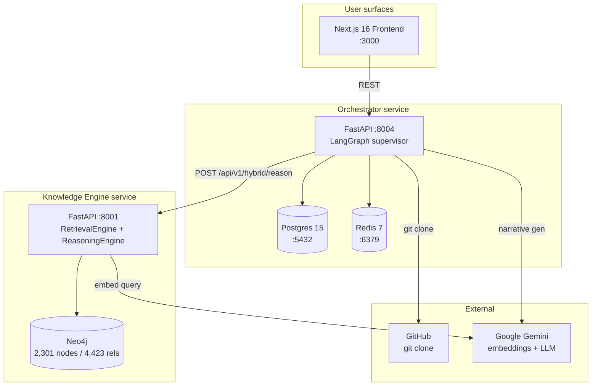

# AlloyCode

> **Static compliance scanner for AI codebases.** Point it at a public GitHub repo; deterministic scanners detect AI-system patterns and map them to **EU AI Act + GDPR obligations** from a 2,301-node Neo4j knowledge graph, returning a report of likely violations with `file:line` anchors and article citations.

The moat is the rule corpus, not the LLM. LLMs are kept out of the detection hot path and write only the post-hoc narrative — every finding is traceable to a YAML rule, a code anchor, and a regulatory article.

---

## What it does

Point AlloyCode at a public GitHub repo and it returns a structured compliance report:

1. **Clone + parse.** Git clone (shallow), tree-sitter AST across the project.
2. **Detect** with a strictly-ordered **6-scanner pipeline** (import → AST → LLM-enrich → AST-rules → content → file-pattern → co-occurrence) against **10 YAML detection rules** covering biometric libs, LLM usage, automated-decision endpoints, transparency gaps, PII without DPIA, opaque training data, missing audit logs, prohibited practices, real-time biometric ID, and override gaps.
3. **Classify.** A deterministic risk classifier produces an EU AI Act category (`PROHIBITED` / `HIGH_RISK` / `LIMITED_RISK` / `MINIMAL_RISK`) + a weighted compliance score.
4. **Map** each finding to the relevant EU AI Act Articles / GDPR Articles / Recitals / Obligations using **hybrid GraphRAG** (vector search + multi-hop Neo4j traversal + RRF fusion) over the regulatory KG.
5. **Synthesise** an executive summary + remediation plan via a 4-node LangGraph supervisor.

The detection layer is deterministic; the LLM only writes prose at the end.

## Architecture at a glance



Three live services + three datastores. Two FastAPI backends (Python) + a Next.js 16 frontend (React 19 + Tailwind 4), orchestrated by LangGraph. Designed for Google Cloud Run.

## Headline numbers

| | |
|---|---|
| **Citation recall@15** | **81.8% (27/33)** on the **25-query** golden set (hybrid RRF). Vector-only: 72.7%. Graph-only: 21.2%. **Context relevance@15 (RAGAS-equivalent): 45.9%**. See [`devlog/METRICS.md`](devlog/METRICS.md). |
| Knowledge graph | **2,301 nodes / 4,423 relationships** (Neo4j) |
| Vector index | **2,198 embeddings** at 3072-dim (`gemini-embedding-001`), Neo4j-native HNSW |
| Vector collections | 7 — articles, obligations, recitals, definitions, concepts, rights, interpretive |
| Cross-regulation edges | 84 `COMPLEMENTS` edges spanning 5 interaction types |
| Detection rules | **10 YAML rules** (rule-as-data, Semgrep-style) |
| Scanner pipeline | 6 ordered stages (import / AST / LLM-enrich / AST-rules / content / file-pattern / co-occurrence) |
| Orchestrator graph | **4-node linear LangGraph** (`classify_risk → research_legal → generate_narrative → synthesize`) |
| Cost discipline | LLM kept out of detection hot path; per-scan `cost_tracker` reports `$/scan` |
| Golden test cases | 6, including résumé screening and credit scoring (both EU AI Act Annex III high-risk categories) |

## Live demo

- **Frontend:** https://aegis-frontend-whfa7vg4ea-ew.a.run.app/
- **Knowledge Engine API:** https://aegis-knowledge-engine-whfa7vg4ea-ew.a.run.app/health (returns the live KG counts — 7 collections, 2,198 docs, 2,301 nodes)
- **Orchestrator API:** https://aegis-orchestrator-whfa7vg4ea-ew.a.run.app/health
- **Loom walkthrough:** _(pending)_

> The Cloud Run service URLs were minted under the project's earlier "Aegis" name (now deprecated — see [`devlog/SYSTEM.md`](devlog/SYSTEM.md) §7 Glossary). The page content + product name is AlloyCode. URL renames are a future cleanup ([`devlog/NORTHSTAR.md`](devlog/NORTHSTAR.md) Part IV: "Renaming AlloyCode again" is correctly-deferred).

The local Docker Compose stack reproduces the full pipeline end-to-end. See the [Quickstart](#quickstart) below.

## Why this exists

The pre-pivot version of this project was a free-text RAG Q&A bot — type a description of your AI system into a textbox, five agents argue about its risk category. Three problems killed it: input was vibes, every demo looked the same, and there was no differentiator versus any other LLM-wrapper project.

The pivot to static code scanning came from looking at the AI-governance landscape and noticing a gap: Credo AI / Holistic AI collect self-reported answers; Fairlearn / AIF360 audit runtime models with training-data access; Guardrails AI validates LLM outputs. **Nothing statically reads AI application code against regulatory obligations.** AlloyCode fills that gap.

The pivot is documented in [`devlog/design-evolution/v02-static-scanner-pivot.md`](devlog/design-evolution/v02-static-scanner-pivot.md); the rule corpus build-out is [`v03-kb-completion.md`](devlog/design-evolution/v03-kb-completion.md); the deliberate removal of human-in-the-loop is [`v04-hitl-decision.md`](devlog/design-evolution/v04-hitl-decision.md).

## Quickstart

Local dev (one-time setup):

```bash
# 1. Clone
git clone https://github.com/sahabajalam/Project_1_EUAI_GDPR.git
cd Project_1_EUAI_GDPR

# 2. Spin up Postgres + Redis + Neo4j + both backends + frontend
docker compose up -d

# 3. Open the UI
#    http://localhost:3000
```

Full local-dev runbook (UV + npm, individual services, env vars, secrets) and Google Cloud Run deploy are in [`devlog/DEPLOYMENT.md`](devlog/DEPLOYMENT.md). The lifecycle controller [`gcp.ps1`](gcp.ps1) wraps the deploy/cleanup paths (`./gcp.ps1 -Action deploy` / `./gcp.ps1 -Action cleanup`).

## Project structure

```
.
├── orchestrator/        FastAPI + LangGraph + 6-scanner code analyzer (Python)
├── knowledge_engine/    FastAPI + Neo4j retrieval (Python)
├── frontend/            Next.js 16 + React 19 + Tailwind 4 (TypeScript)
├── docker-compose.yml   Local dev — 3 services + 3 datastores
├── gcp.ps1              Cloud Run lifecycle controller
├── devlog/              The full living-docs system (see below)
└── 07_MARKET_FIT_AND_PORTFOLIO_AUDIT.md   June-2026 portfolio audit (input to NORTHSTAR)
```

## Where to go next

Pick the doc that matches what you're trying to do:

| Looking for | Read |
|---|---|
| **Current architecture, code-audited** | [`devlog/SYSTEM.md`](devlog/SYSTEM.md) |
| **Strategy / what's next / what to refuse** | [`devlog/NORTHSTAR.md`](devlog/NORTHSTAR.md) |
| **Quantified retrieval metrics** | [`devlog/METRICS.md`](devlog/METRICS.md) |
| **What changed and why** | [`devlog/CHANGELOG.md`](devlog/CHANGELOG.md) |
| **How design decisions were made** | [`devlog/design-evolution/`](devlog/design-evolution/) (`v01` → `v04`) |
| **How to deploy** | [`devlog/DEPLOYMENT.md`](devlog/DEPLOYMENT.md) |
| **Where the brainstorm trail lives** | [`devlog/history/`](devlog/history/) (frozen archive) |
| **The portfolio narrative** | [`devlog/JOURNEY.md`](devlog/JOURNEY.md) |
| **Interview-style line-by-line defence of design choices** | [`devlog/INTERVIEW_GUIDE.md`](devlog/INTERVIEW_GUIDE.md) |

The devlog follows the [`DOCS_PLAYBOOK.md`](DOCS_PLAYBOOK.md) at the project root — a portable methodology for keeping project documentation legible to AI coding agents over long development arcs.

## Status

Single-developer portfolio project. Phase-1 scope: 10 deterministic detection rules, 6-scanner pipeline, 4-node LangGraph supervisor, regulatory KG covering EU AI Act + GDPR + EDPB guidelines + CJEU case law + recent enforcement actions. Built to validate the architectural hypothesis that **code-grounded compliance reporting beats free-text self-assessment for AI-governance tooling.**

Not a production compliance tool; not a substitute for legal advice; not certified for conformity-assessment use. The reports surface evidence — a human compliance officer makes the call.

## License

Single-developer portfolio project. No license declared yet — contact the author before reuse.

---

*Repository directory name: `Project_1_EUAI_GDPR/`. Canonical external name: **AlloyCode**. The earlier marketing name "Aegis Compliance Engine" is deprecated — surviving references are being phased out as touched.*
