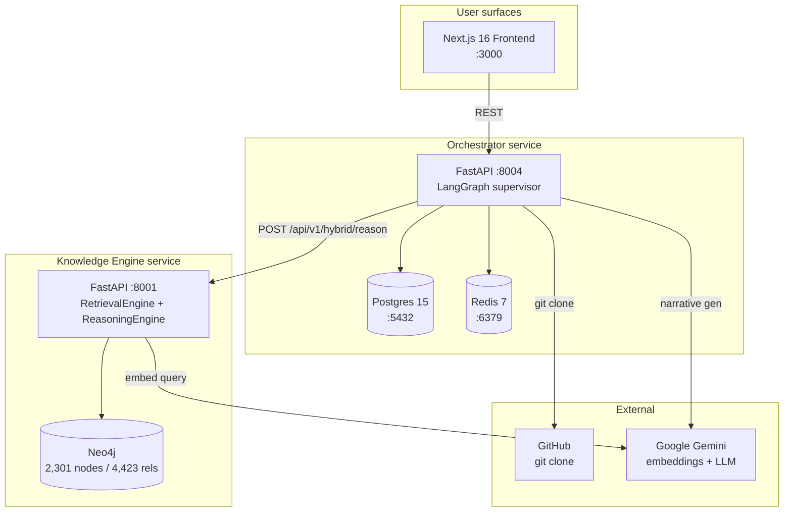

# AlloyCode — System Documentation

**AlloyCode** is a static compliance scanner for AI codebases. Point it at a public GitHub repo; deterministic scanners detect AI-system patterns and map them to EU AI Act + GDPR obligations from a 2,301-node Neo4j knowledge graph, returning a report of likely violations with `file:line` anchors and article citations. Two service backends (Python/FastAPI) plus a Next.js 16 frontend, orchestrated by LangGraph. The moat is the rule corpus; LLMs are kept out of the detection hot path and write only the post-hoc narrative.

The project's external name is **AlloyCode** (code, UI, portfolio docs, scripts). *Aegis Compliance Engine* was an earlier marketing name now deprecated — surviving references are being phased out as touched. *EU_AI_GDPR* is the repo directory name only (a path-level artifact, not a brand). See §7 Glossary.

---

## Architecture at a glance



---

## 1. High-level architecture

Three live services + three datastores. The `monitor/` module shown in pre-pivot architecture diagrams has been **decommissioned** — drift/bias/Prometheus machinery provided no usable signal in a portfolio demo without continuous production traffic. See [`design-evolution/v02-static-scanner-pivot.md`](design-evolution/v02-static-scanner-pivot.md) for the rationale.

```
┌─────────────────────────────────────────────────────────────────────┐
│ FRONTEND  Next.js 16 + React 19 + TS5 + Tailwind   port 3000        │
│  pages: / (dashboard) · /scans · /scans/[id] · /knowledge           │
└──────────────────────────────────┬──────────────────────────────────┘
                                   │ NEXT_PUBLIC_API_URL → http://orchestrator:8004
                                   ▼
┌─────────────────────────────────────────────────────────────────────┐
│ ORCHESTRATOR  FastAPI + LangGraph    port 8004                      │
│  • code_analyzer/  — git clone + tree-sitter AST + 6-scanner pipe   │
│  • agents/         — RiskClassifier, LegalResearch,                 │
│                      DocumentationGenerator, Supervisor             │
│  • database/       — SQLAlchemy async over Postgres                 │
│  • cache/          — Redis client                                   │
│  • control_plane/  — governance + audit log                         │
└──────────────────────────────────┬──────────────────────────────────┘
                                   │ POST /api/v1/hybrid/reason
                                   ▼
┌─────────────────────────────────────────────────────────────────────┐
│ KNOWLEDGE_ENGINE  FastAPI + Neo4j Python driver    port 8001        │
│  • stores/graph_store.py    — Neo4j CRUD + vector index             │
│  • retrieval/engine.py      — hybrid vector + graph (RRF)           │
│  • retrieval/reasoning_engine.py  — multi-hop + Gemini synthesis    │
└─────────────────────────────────────────────────────────────────────┘
```

The orchestrator is the only service that talks to the user. The knowledge engine is an internal API; the orchestrator's `LegalResearchAgent` is the only caller in production.

---

## 2. Data layer

### 2.1 Neo4j (knowledge graph + vector store)

**Status as of 2026-05-20:** the KB went from 12% completeness (Feb 2026 gap analysis) to fully built (Apr 2026). Current counts, sourced from `docs/MEMORY.md` and `docs/REFERENCE.md §1.1`:

| Metric | Value |
|---|---|
| Nodes (total) | **2,301** |
| Relationships | **4,423** (one source quotes 4,431 — verify with `MATCH ()-[r]->() RETURN count(r)`) |
| Entity types | 17 (super-label `:Entity` + one specialized label per node) |
| Relationship types | 13 |
| Cross-regulation edges | 84 `COMPLEMENTS` edges spanning 5 interaction types |
| Vector embeddings | **2,198 docs**, **3072-dim** (`gemini-embedding-001`) stored as `:Entity.embedding` |
| Vector index | `entity_embedding` — single Neo4j-native index over all collections, filtered by `n.collection` |
| Vector collections | 7: `articles`, `obligations`, `recitals`, `definitions`, `concepts`, `rights`, `interpretive` |
| Orphan nodes | 0 (100% connectivity) |
| Avg relationships per article | 19.1 |

**Schema highlights** (from [`knowledge_engine/src/stores/graph_store.py`](../knowledge_engine/src/stores/graph_store.py) + [`knowledge_engine/src/schema/`](../knowledge_engine/src/schema/)):
- Unique constraint on `:Entity(id)` (e.g., `GDPR_ART_35`, `AIACT_ART_6`).
- Per-entity-type index on `(label, id)` for fast lookups.
- Vector index dimensions = 3072, similarity = cosine.

> **Drift note:** earlier audits cited a 768-dim embedding for the same model. The current code uses 3072 dim (graph_store.py:45). If you read a doc claiming 768, it is stale.

### 2.2 Postgres (scan state)

[`orchestrator/src/database/models.py`](../orchestrator/src/database/models.py) defines the scan lifecycle tables. Async access via SQLAlchemy; connection from `DATABASE_URL`. Lifecycle states: `queued → running → completed | failed`.

### 2.3 Redis (cache)

[`orchestrator/src/cache/redis_client.py`](../orchestrator/src/cache/redis_client.py) — fail-open cache for scan metadata. The service degrades gracefully when Redis is unavailable; the `/health` endpoint reports `degraded` rather than failing.

---

## 3. Backend modules

### 3.1 Orchestrator — scan pipeline ([`orchestrator/src/code_analyzer/`](../orchestrator/src/code_analyzer/))

`run_scan(scan_id, repo_url, ref)` in [`scan.py`](../orchestrator/src/code_analyzer/scan.py):

1. `ingest()` — `git clone --depth=1` into a temp workspace; build file index + dep manifest; detect topology.
2. `_scan_and_profile()` — runs a strictly-ordered **6-scanner pipeline** (order matters; later scanners read shared state populated by earlier ones):

   ```
   ImportScanner  →  AstScanner  →  [LLM enrich surfaces]  →  AstRulesScanner
                 →  ContentScanner  →  FilePatternScanner  →  CooccurrenceScanner
   ```

   Imports first (populates the shared module/library map), then AST (collects "decision surfaces" — function defs that look like model-inference call sites or decisioning code), then an LLM pass that drops test/mock surfaces (fail-open: regex verdicts are kept if the LLM call fails), then AST rules apply to the cleaned surfaces, then content scanners emit `pii_fields`, then file-pattern scanners (model cards / DPIA docs), then cooccurrence last.
3. `build_profile()` — aggregates findings into an `AISystemProfile` JSON: `{scan_id, repo_info, findings[], shared}`.

Rule catalog lives at [`orchestrator/src/code_analyzer/rules/`](../orchestrator/src/code_analyzer/rules/) loaded by `rule_loader.py`. Phase-1 scope: 10 MVP detection rules.

### 3.2 Orchestrator — LangGraph supervisor ([`orchestrator/src/agents/supervisor.py`](../orchestrator/src/agents/supervisor.py))

Linear graph, **no HITL branch**:

```
classify_risk → research_legal → generate_narrative → synthesize → END
```

| Node | Agent class | LLM? | Purpose |
|---|---|---|---|
| `classify_risk` | `RiskClassifierAgent` | **No** | Deterministic EU AI Act category (`PROHIBITED` / `HIGH_RISK` / `LIMITED_RISK` / `MINIMAL_RISK`) + weighted compliance score. Prohibited triggers: rule IDs `AI-008`, `AI-009`. |
| `research_legal` | `LegalResearchAgent` | Yes (KE LLM) | Queries `POST /api/v1/hybrid/reason` on knowledge engine; returns mapped Articles + Obligations + Recitals per finding. |
| `generate_narrative` | `DocumentationGeneratorAgent` | Yes (Gemini) | Writes executive summary + remediation plan as markdown. Post-hoc only; not in the detection path. |
| `synthesize` | (inline in supervisor) | No | Merges `profile`, `risk_posture`, `narrative`, `finding_citations` into the final `ScanReport`. |

> **Drift note:** `docs/README.md` (now archived under `history/01-research-arc.md`) describes a HITL approval pause for Critical findings. The current supervisor explicitly removed this — see the docstring at the top of [`supervisor.py`](../orchestrator/src/agents/supervisor.py): *"No HITL branch: static scanners produce deterministic, auditable evidence, so there is no classification-uncertainty branch to pause on."* The full decision record (rationale, EU-AI-Act counter-argument, conditions for revisiting) lives at [`design-evolution/v04-hitl-decision.md`](design-evolution/v04-hitl-decision.md).

### 3.3 Knowledge Engine ([`knowledge_engine/src/`](../knowledge_engine/src/))

- [`stores/graph_store.py`](../knowledge_engine/src/stores/graph_store.py) — Neo4j CRUD + native vector search + multi-hop traversal + entity resolution (fuzzy name → node ID).
- [`retrieval/engine.py`](../knowledge_engine/src/retrieval/engine.py) — `RetrievalEngine`. Hybrid query: embed → vector search → graph expansion → RRF fusion.
- [`retrieval/reasoning_engine.py`](../knowledge_engine/src/retrieval/reasoning_engine.py) — `ReasoningEngine.answer(request)`. Multi-hop traversal + Gemini synthesis. Returns answer + citations.

---

## 4. API surface

### 4.1 Orchestrator (FastAPI, port 8004)

Routes registered in [`orchestrator/src/api/main.py`](../orchestrator/src/api/main.py) + [`orchestrator/src/api/scans.py`](../orchestrator/src/api/scans.py):

| Method | Path | Purpose |
|---|---|---|
| `GET` | `/` | Service metadata + endpoint index |
| `GET` | `/health` | Health check (`supervisor`, `control_plane`, `database`) |
| `POST` | `/api/v1/scans` | Start a new scan (body: `{repo_url, ref?}`) → 202 + `scan_id` |
| `GET` | `/api/v1/scans` | List scans |
| `GET` | `/api/v1/scans/{id}` | Full scan record |
| `GET` | `/api/v1/scans/{id}/findings` | Flat findings list |
| `GET` | `/api/v1/scans/{id}/report` | Synthesized `ScanReport` |
| `GET` | `/api/v1/statistics` | Aggregate counts + status histogram |
| `GET` | `/api/v1/audit-log` | Control-plane audit log (filterable by agent) |

CORS: configurable via `settings.get_cors_origins()`.

### 4.2 Knowledge Engine (FastAPI, port 8001)

Routes in [`knowledge_engine/src/api/main.py`](../knowledge_engine/src/api/main.py):

| Method | Path | Purpose |
|---|---|---|
| `GET` | `/health` | Neo4j + vector index liveness + per-collection counts |
| `POST` | `/api/v1/vector/search` | Pure vector similarity search across collections |
| `POST` | `/api/v1/graph/resolve` | Fuzzy: natural-language term → Neo4j node IDs |
| `POST` | `/api/v1/graph/traverse` | Multi-hop traversal from seed entities (auto-resolves names by default) |
| `POST` | `/api/v1/hybrid/search` | RRF-fused vector + graph results |
| `POST` | `/api/v1/hybrid/reason` | Multi-hop reasoning with Gemini synthesis (the main entry for `LegalResearchAgent`) |

### 4.3 Frontend → backend

Single env var: `NEXT_PUBLIC_API_URL` → orchestrator base URL. The frontend never calls the knowledge engine directly.

---

## 5. Frontend

[`frontend/`](../frontend/) — Next.js 16 (App Router) + React 19 + TypeScript 5 + TailwindCSS + Framer Motion + Lucide icons.

Pages under [`frontend/src/app/`](../frontend/src/app/):

| Path | Purpose |
|---|---|
| `/` ([`page.tsx`](../frontend/src/app/page.tsx)) | Dashboard: scan list, risk distribution chart, platform stats |
| `/scans` ([`scans/`](../frontend/src/app/scans/)) | Scan index + per-scan detail under `[id]` |
| `/knowledge` ([`knowledge/`](../frontend/src/app/knowledge/)) | KB browser — search articles, view obligations |

Layout in [`layout.tsx`](../frontend/src/app/layout.tsx), global styles in [`globals.css`](../frontend/src/app/globals.css).

---

## 6. Deploy

**Local (Docker Compose):** [`docker-compose.yml`](../docker-compose.yml) brings up:
- `orchestrator` (build: `./orchestrator`) — port 8004
- `orchestrator-db` (image: postgres:15-alpine) — port 5432
- `orchestrator-redis` (image: redis:7-alpine) — port 6379
- `graphrag-api` (build: `./knowledge_engine`, container name `alloycode-knowledge-engine`) — port 8001

Network: `compliance-network` (bridge). Volumes: `orchestrator_postgres_data`, `orchestrator_redis_data`.

> **Note:** Neo4j is NOT in `docker-compose.yml`. The knowledge engine connects to an external Neo4j instance via `NEO4J_URI` / `NEO4J_USER` / `NEO4J_PASSWORD` env vars (e.g., Neo4j Aura cloud).

**Cloud Run (production demo):** [`frontend/cloudbuild.yaml`](../frontend/cloudbuild.yaml) + [`gcp.ps1`](../gcp.ps1) + [`.github/workflows/`](../.github/workflows/) — three Cloud Run services, env-injected secrets, custom domain mapping.

**Full operational details:** [`DEPLOYMENT.md`](DEPLOYMENT.md) (`status: accepted`). Don't duplicate its contents here; cross-link.

---

## 7. Glossary

| Term | Meaning |
|---|---|
| **AlloyCode** | **Canonical external name.** Use this everywhere — code, UI, scripts, portfolio docs, public-facing material. |
| **Aegis Compliance Engine** | **Deprecated.** Earlier marketing name; surviving references are being phased out as touched (see [`CHANGELOG.md`](CHANGELOG.md) 2026-06-16). Do not introduce new uses. |
| **EU_AI_GDPR** | Repo directory name only — a path-level artifact, not a brand. Not for user-facing copy. |
| **risk posture** | The `RiskClassifierAgent` output: category + severity counts + compliance score (0–100). |
| **Risk categories** | EU AI Act tiers: `PROHIBITED`, `HIGH_RISK`, `LIMITED_RISK`, `MINIMAL_RISK`. |
| **prohibited triggers** | Rule IDs that force `PROHIBITED` regardless of other signals. Currently: `AI-008`, `AI-009`. |
| **decision surface** | A code location (function def, route handler) where the system makes an AI-driven decision; collected by `AstScanner`, filtered by the LLM reviewer, then consumed by `AstRulesScanner`. |
| **finding** | One detection: `{rule_id, file, line, excerpt, severity, confidence, suppressed?}`. |
| **profile / AISystemProfile** | Structured replacement for the pre-pivot free-text input. Aggregated findings + repo metadata + scanner-shared state. |
| **GraphRAG** | The retrieval pattern in the knowledge engine: vector search + graph traversal + RRF fusion + LLM synthesis. |
| **RRF** | Reciprocal Rank Fusion. The merge used by `RetrievalEngine` to combine vector hits and graph paths. |
| **HITL** | Human-in-the-loop. *Removed* from the current supervisor — see §3.2 drift note and [`design-evolution/v04-hitl-decision.md`](design-evolution/v04-hitl-decision.md) for the full decision record. |

---

## 8. How to maintain this document

When the system changes:

1. **Update the relevant section here** — keep the numbered structure stable; readers and agents bookmark these section numbers.
2. **Append a dated entry to [`CHANGELOG.md`](CHANGELOG.md)** with `What / Why / Impact on SYSTEM.md / Refs`.
3. **Bump `last_verified:`** in the frontmatter to today's date.
4. **If a section disagrees with the code, the code wins** — fix the doc, not the code (unless the change in code is itself the bug, in which case raise it separately).
5. **Do not edit this doc during pure research / Q&A sessions.** If the code hasn't changed, this doc shouldn't either. Drift discoveries → flag to the user; don't silently rewrite.
6. **Don't grow this doc beyond ~600 lines.** When a section starts to dominate, push the detail into a `vNN-*.md` proposal (for forward-looking) or absorb the older content into `history/` (for past state).
